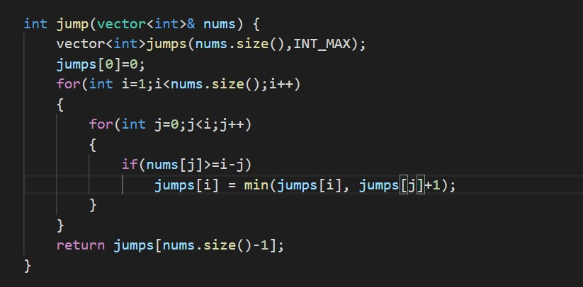

# MinJumpsGame

<b>Jump Game is a very famous Problem during the interviews, and which is most askable problem in various contests as well as phone interviews.</b>

<u style="font-size: 20px;"><b> <u>Problem Statement:</u></b></u>

<pre><code>
Given an array of <b>non-negative integers (num[i]>0) </b>, you are initially positioned at the first index of the array.

Each element in the array represents your maximum jump length at that position.

<b>Your goal is to reach the last index in the minimum number of jumps.</b>

You can assume that you can always reach the last index.
</code></pre>
 
<pre><code>
<b>Example 1:</b>

Input: nums = [2,2,3,1,1,3,3,2,3,1,1,1,1,2,1,2,3,3,3,3,1,2,2,3,3,3,1,1,1]

Output: 14

Explanation: The minimum number of jumps to reach the last index is 14. Jump 1 step from index 0 to 2 ,see the following jump array, where arr[i] indicates the number of jumps.

Output array=[2,3,3,3,1,1,2,1,2,3,2,2,3,1]
</code></pre>
 
 
<pre><code>
<b>Example 2:</b>

Input: nums = [1,3,2,1,2,1,3,2,3,1,1,1,1,1,2,3,2,2,2,3,2,1,1,3,1,3,1,2,3]

Output: 16

Explanation: The minimum number of jumps to reach the last index is 16. Jump 1 step from index 0 to 1,see the following jump array, where arr[i] indicates the number of jumps.

Output array=[1,3,2,2,3,1,1,1,1,2,2,3,1,2,2,2]
</code></pre>

## Note: In this problem we are not considering 0 as a minimum jump , coz , if player hits the zero then it won't jumps further.

<pre><code>
<b>Constraints:</b>

1 <= nums.length <=3 *<var>10</var>4 
1<=nums[i] <=<var>10</var>5
</code></pre>

<b>Approach & Solution: </b>

                            
There are many ways to solve this problem, but two ways are very famous. One uses
                                <b>Dynamic Programing</b> and takes a time of <b>O(N²)</b> while the other solution is a
                                little smarter and operates in <b>O(N)</b> time.
                            
<b>Here we are talking about O(N²) solution.</b>

                            
So, let’s see both the approaches and solutions one by one.

                            
 The first solution uses Dynamic Programming and takes a time of O(N²). (It can give TLE
                                error in LeetCode). Also, this solution uses O(N) space since we need to maintain an
                                extra jumps array so it is definitely not optimal.

                            
In this, we first build a new array jumps which will store INT_MAX (maximum value in the
                                respective languages). The purpose of this jumps array is to keep track of the minimum
                                number of jumps needed to reach that particular index.

                            
So, we define jumps[0]=0 since we don’t require any jump to reach the 0th index. Now, we
                                start a loop from the second array element till the last one. For each element, we have
                                an inner loop which runs from the first element till that particular element. For each
                                inner element, we check whether we can reach from that element to the outer element for
                                which the inner loop is running in a single jump. If yes, we update the value of
                                jumps[i] = min(jumsp[i], jumps[j]+1). This allows us to find the minimum number of jumps
                                required to reach that particular index.

                            
This uses previous results and so is using Dynamic Programming. Since we have one outer
                                loop running through each element of the array and an inner loop running from 0 to ith
                                index, so it is O(N²). Also, we have an extra jumps array which consumes O(N) extra
                                space.

                            
                             
                             
                            
<u><b>Visualiation:</b></u>

                            <!-- 
Initialy Frog at 0th index 
 -->
                            

                            
                            
                            
                            
                            
## Contributor
 *  <a href="https://github.com/Nilesh1206">Nilesh Gopale</a>
<!--  *  <a>Kshitija Zine</a> -->
